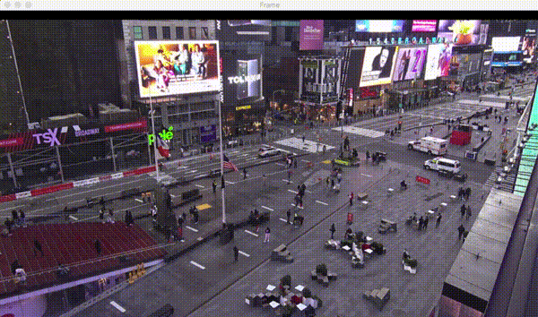
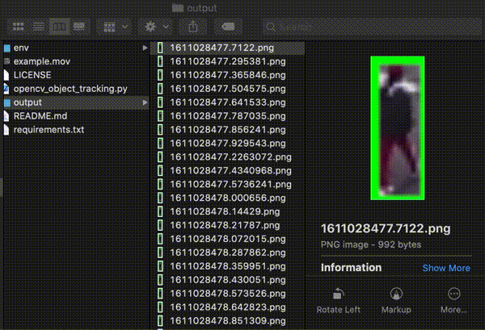

# **VDO Object Detection & Cropping Region of Interest(ROI)**

Let's cropping object in your VDO, this script reference to article [OpenCV Object Tracking](https://www.pyimagesearch.com/2018/07/30/opencv-object-tracking/) of **Adrian Rosebrock**



I have modified it by adding crop image in ROI function :

```python
imCrop = frame[int(box[1]):int(box[1]+box[3]), int(box[0]):int(box[0]+box[2])]
cv2.imwrite('./output/{}.png'.format(time.time()), imCrop)
```

Output files are image in ROI in each second.


## **Installation**

Create Python environment, it supports Python >= 3.4 but < 3.9

```bash
$ python3 -m venv env

# activate the environment :
$ source ./env/bin/activate

# then install dependencies :
(env) $ pip install -r requirements.txt
```

## **Usage**

activate the environment

```bash
$ source ./env/bin/activate
```

now your project directory should look like this :

```bash
project
|- env
|  `...
|- output
|  `...
|- opencv_object_tracking.py
|- README.md
|- requirements.txt
`- YOUR_VDO_NAME.mp4   #  <------ require
```

Or you can use our clip, it was captured from YouTube channel [EarthCam Live: Times Square in 4K](https://www.youtube.com/watch?v=eJ7ZkQ5TC08) via QuickTime Player App on MacOS, you can download it from my [dropbox](https://www.dropbox.com/s/l7ebr1ookxngukz/ex-world-camera-shot-clip.mov?dl=1).

Before start :
 - press `s` is select ROI then press `enter` to start VDO.
 - press `q` to exit the application.

let's run the cropper :

```bash
$ python opencv_object_tracking.py --video YOUR_VDO_NAME.mp4 --tracker csrt
```

## **Tracking mode**

The available arguments for --tracker include:
 - **csrt** - Discriminative Correlation Filter (with Channel and Spatial Reliability). Tends to be more accurate than KCF but slightly slower. (minimum OpenCV 3.4.2)

not available list :
 - **kcf** - Kernelized Correlation Filters. Faster than BOOSTING and MIL. Similar to MIL and KCF, does not handle full occlusion well. (minimum OpenCV 3.1.0)
 - **boosting** - Based on the same algorithm used to power the machine learning behind Haar cascades (AdaBoost), but like Haar cascades, is over a decade old. This tracker is slow and doesn’t work very well. Interesting only for legacy reasons and comparing other algorithms. (minimum OpenCV 3.0.0)
 - **mil** - Better accuracy than BOOSTING tracker but does a poor job of reporting failure. (minimum OpenCV 3.0.0)
 - **tld** - I’m not sure if there is a problem with the OpenCV implementation of the TLD tracker or the actual algorithm itself, but the TLD tracker was incredibly prone to false-positives. I do not recommend using this OpenCV object tracker. (minimum OpenCV 3.0.0)
 - **medianflow** - Does a nice job reporting failures; however, if there is too large of a jump in motion, such as fast moving objects, or objects that change quickly in their appearance, the model will fail. (minimum OpenCV 3.0.0)
 - **mosse** - Very, very fast. Not as accurate as CSRT or KCF but a good choice if you need pure speed. (minimum OpenCV 3.4.1)

> **Adrian Rosebrock** suggestion is to:
> 
> Use CSRT when you need higher object tracking accuracy and can tolerate slower FPS throughput
Use KCF when you need faster FPS throughput but can handle slightly lower object tracking accuracy
Use MOSSE when you need pure speed

## **License**

MIT